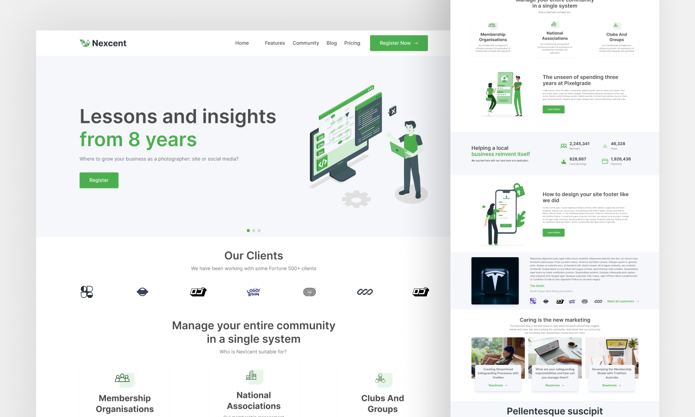

# Landing Page - Nexcent

> 🚀 Landing Page desenvolvida através de um layout feito no Figma, usando HTML e CSS, olhando o layout e codificando.

## ⚙️ Ajustes e melhorias

O projeto ainda está em desenvolvimento e as próximas atualizações serão voltadas nas seguintes tarefas:

- [x] Navbar
- [x] Hero Section
- [x] Body Section
- [x] Footer
- [ ] Responsividade

## 🚀 Tecnologias

## 📫 Contribuindo para Nexcent
<!---Se o seu README for longo ou se você tiver algum processo ou etapas específicas que deseja que os contribuidores sigam, considere a criação de um arquivo CONTRIBUTING.md separado--->
Para contribuir com Nexcent, siga estas etapas:

1. Bifurque este repositório.
2. Crie um branch: `git checkout -b <nome_branch>`.
3. Faça suas alterações e confirme-as: `git commit -m '<mensagem_commit>'`
4. Envie para o branch original: `git push origin <nome_do_projeto> / <local>`
5. Crie a solicitação de pull.

Como alternativa, consulte a documentação do GitHub em [como criar uma solicitação pull](https://help.github.com/en/github/collaborating-with-issues-and-pull-requests/creating-a-pull-request).

## 🤝 Colaboradores

Agradecemos às seguintes pessoas que contribuíram para este projeto:

<table>
  <tr>
    <td align="center">
      <a href="#">
         
        
          <b>Neander de Souza</b>
        
      </a>
    </td>    
  </tr>
</table>
